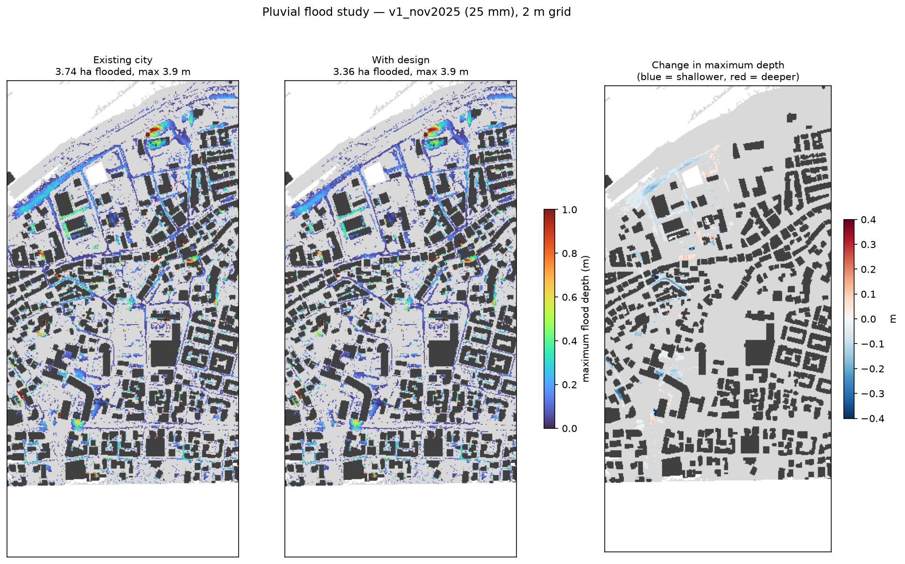

# Flood study report

Storm: **v1_nov2025** (25.4 mm). Solver: local-inertial shallow-water, 2 m grid.

| metric | baseline | design | change |
|---|---|---|---|
| Flooded area (> 10 cm), ha | 3.74 | 3.36 | -0.39 (-10.4 %) |
| Deep flooding (> 30 cm), ha | 0.92 | 0.83 | -0.09 (-9.8 %) |
| Maximum depth, m | 3.91 | 3.91 | +0.00 (+0.0 %) |
| Rain infiltrated, % | 4.71 | 14.04 | +9.34 (+198.4 %) |
| Outflow to port/sea, m3 | 3,654.12 | 3,089.77 | -564.35 (-15.4 %) |
| Hazardous area (h(v+0.5) > 0.75), ha | 0.27 | 0.24 | -0.04 (-12.8 %) |
| Buildings with >= 20 % of the facade zone under > 10 cm | 111.00 | 97.00 | -14.00 (-12.6 %) |

Design: 1 bioretention pond / rain garden, 1 bioswale, 1 porous bikelane, 1 permeable paving, 14 trees, 4 drains, 1 official Masar corridor

Method note: live local-inertial solver validated against the published 0.5 m GPU runs (flooded-area IoU 0.86, depth correlation 0.95); the study's 600 drain inlets are treated as clogged (25 Nov 2025 failure mode); results at this grid size are for design comparison, not for sizing.