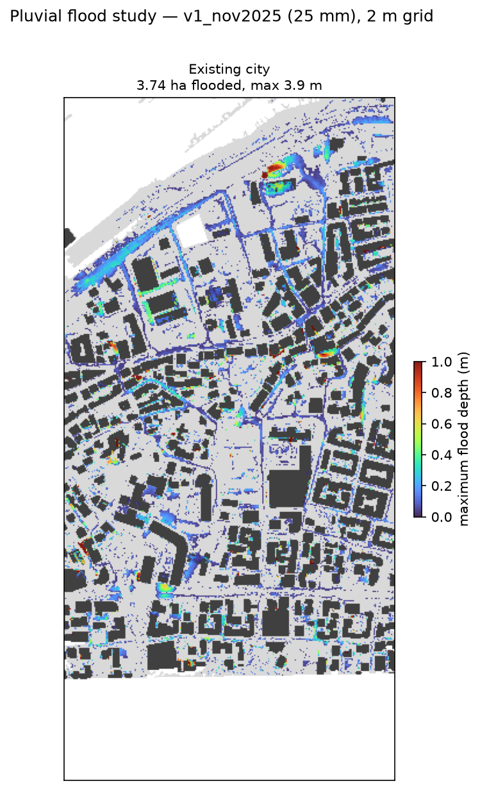

# Flood study report

Storm: **v1_nov2025** (25.4 mm). Solver: local-inertial shallow-water, 2 m grid.

| metric | baseline |
|---|---|
| Flooded area (> 10 cm), ha | 3.74 |
| Deep flooding (> 30 cm), ha | 0.92 |
| Maximum depth, m | 3.91 |
| Rain infiltrated, % | 4.71 |
| Outflow to port/sea, m3 | 3,654.12 |
| Hazardous area (h(v+0.5) > 0.75), ha | 0.27 |
| Buildings with >= 20 % of the facade zone under > 10 cm | 111.00 |

Design: empty

Method note: live local-inertial solver validated against the published 0.5 m GPU runs (flooded-area IoU 0.86, depth correlation 0.95); the study's 600 drain inlets are treated as clogged (25 Nov 2025 failure mode); results at this grid size are for design comparison, not for sizing.